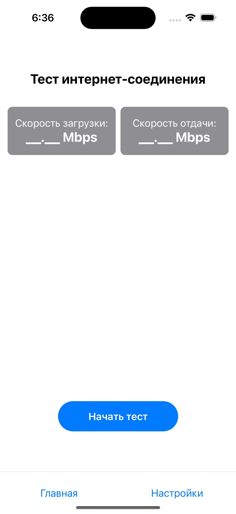
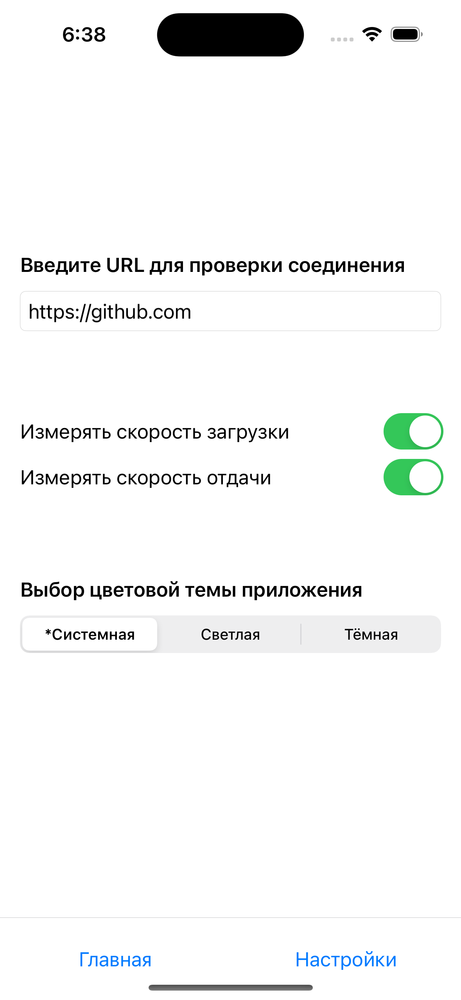
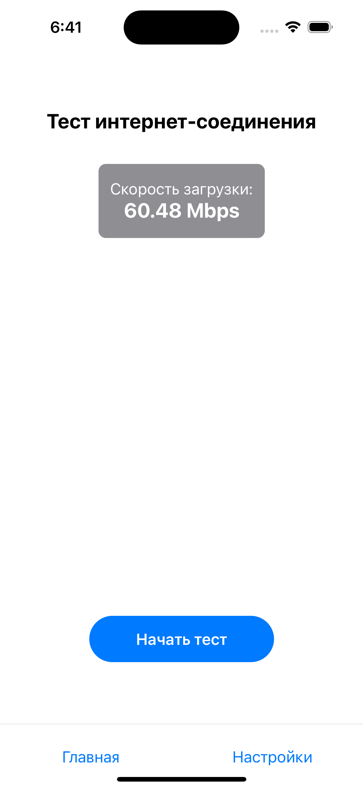
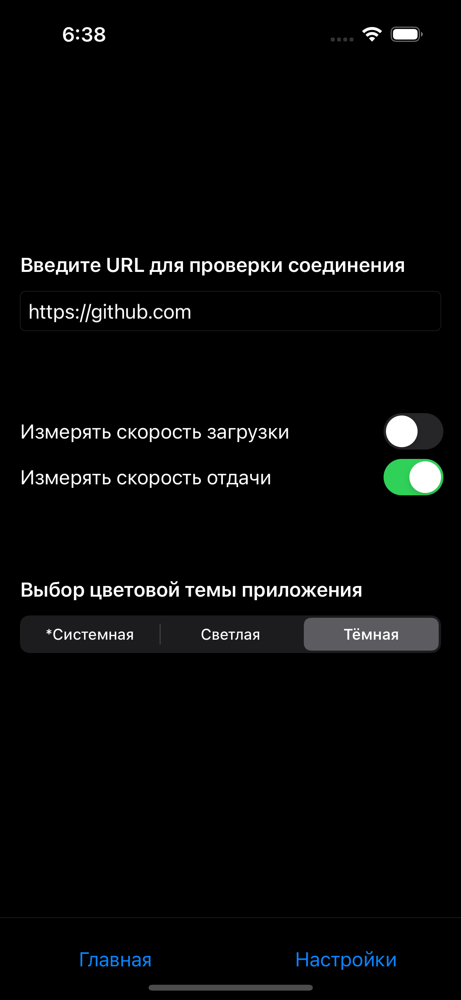
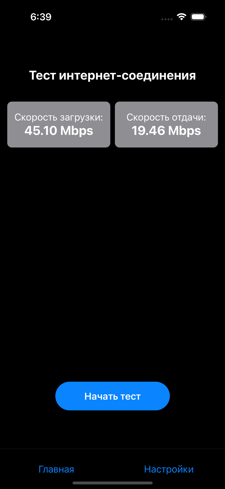

Тестовое Задание 
# NetworkSpeedTest Application
Приложение для замера скорости загрузки и отдачи интернет-соединения

# Реализованные возможности:
- Замер скорости загрузки и отдачи интернет-соединения
- 2 экрана: тест скорости интернета и экран настроек
- Замер проводиться по заданному пользователем URL-адресу
- Возможность включать / отключать измерение загрузки и отдачи
- Возможность менять тему оформления (системная, светлая, темная)
- Навигация между экранами через Navigation Tab Bar (Coordinator)

# Использованный стэк технологий:
- Swift5, Xcode
- SwiftUI
- CocoaPods(side fraemwork NDT7) *Доработанный в приложении для измерения по любому URL и методами для отображения значений скорости
- MVVM + Coordinator
- CoreData (Если вы видите этот текст то на момент коммита функционал не доработан до конца т.к. не успеваю в сроки)

** Alamofire не исользовал т.к использовал другое решение со сторонним фреймворком

# Запуск приложения
## - Через Xcode (Canvas)
- Открыть файл .workspace (не .xcodeproj) для корректного отображения Pod'ов
- Отобразить canvas через CoordinatorVieW
## - Через Simulator

# Screenshots:
## Экраны приложения в светлой теме (до проведения теста, экран настроек, с проведенным тестом и отключенным замером отдачи)

  
  
  

## Экраны приложения в темной теме (экран настроек и проведенным тестом)

  
  

